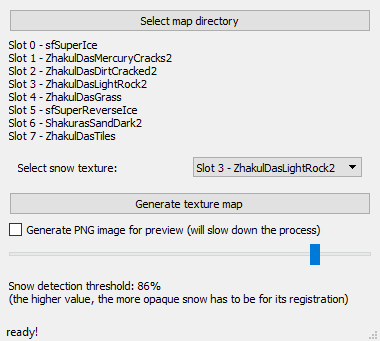
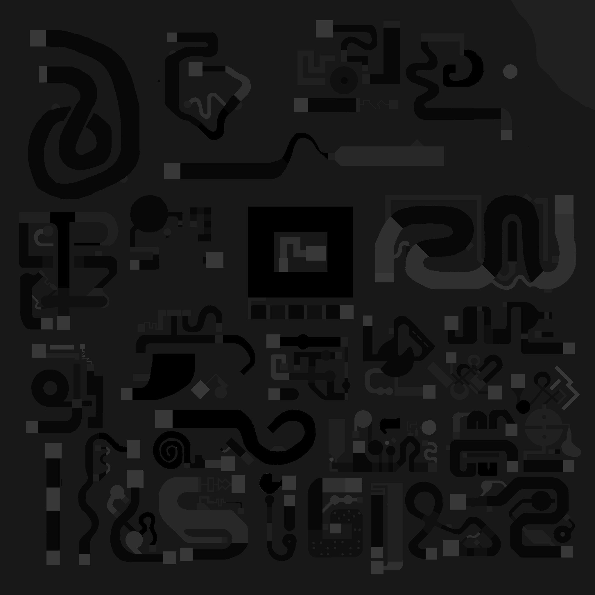

# Texture recognition tool for Starcraft II Maps

Made to be used in **Ice Escape** like maps for *StarCraft II*.

Native API function `string TerrainTexture (point pos);` has its precision limited to one square (max size of a map is 256x256 squares). Thus it's unusable in cases where precise results are required. Because the square in reality is built with 8x8 pixels.

This tool parses `t3TextureMasks` binary file that stores complete data about terrain pixels and their blending value. This is then translated into `TextureMap.galaxy` script file which maps the data into `string` array upon initialization. Size of array is 8 per square Y (can go up to 2048). Length of each string follows same convention.

## App screenshots



## Example of generated terrain map preview



## Generated file example
```c

// snow_index=3
// snow_value=13
string[2048] tm;
void initTextureMap() {
tm[0]="1234567812345678";
...
}
```

## Example implementation
```c
const int SURFACE_SNOW = 1;
const int SURFACE_LAND = 2;
const int SURFACE_NORMAL_ICE = 3;
const int SURFACE_REVERSE_ICE = 4;
const int SURFACE_STRAIGHT_ICE = 5;
const int SURFACE_FAST_ICE = 6;
const int SURFACE_REVERSE_FAST_ICE = 7;

static int sd_mapTextXY(int x, int y)
{
    return StringToInt(StringSub(tm[y], x + 1, x + 1));
}

int sd_getSurfaceAt(point pt) {
    int i;
    int x;
    int y;
    int intX;
    int intY;
    fixed pointX;
    fixed pointY;
    int surface;

    pointX = PointGetX(pt) * 8.0;
    pointY = PointGetY(pt) * 8.0;
    intX = RoundI(pointX);
    intY = RoundI(pointY);
    surface = sd_mapTextXY(intX, intY);

    if (surface != SURFACE_SNOW) {
        return surface;
    }

    // this part is to introduce extended margin tolerance
    if (surface == SURFACE_SNOW) {
        for (y = -1; y <= 1; y += 1) {
            for (x = -1; x <= 1; x += 1) {
                surface = sd_mapTextXY(
                    RoundI( pointX + (IntToFixed(x) * 0.2) ),
                    RoundI( pointY + (IntToFixed(y) * 0.2) )
                );
                if (surface != SURFACE_SNOW) {
                    return surface;
                }
            }
        }
    }

    return surface;
}
```
Returned texture `ID` corresponds to mappings inside `t3Terrain.xml`:
```xml
<textureList num="8">
    <texture i="0" name="sfSuperIce"/>
    <texture i="1" name="ZhakulDasMercuryCracks2"/>
    <texture i="2" name="ZhakulDasDirtCracked2"/>
    <texture i="3" name="ZhakulDasLightRock2"/>
    <texture i="4" name="ZhakulDasGrass"/>
    <texture i="5" name="sfSuperReverseIce"/>
    <texture i="6" name="ShakurasSandDark2"/>
    <texture i="7" name="ZhakulDasTiles"/>
</textureList>
```